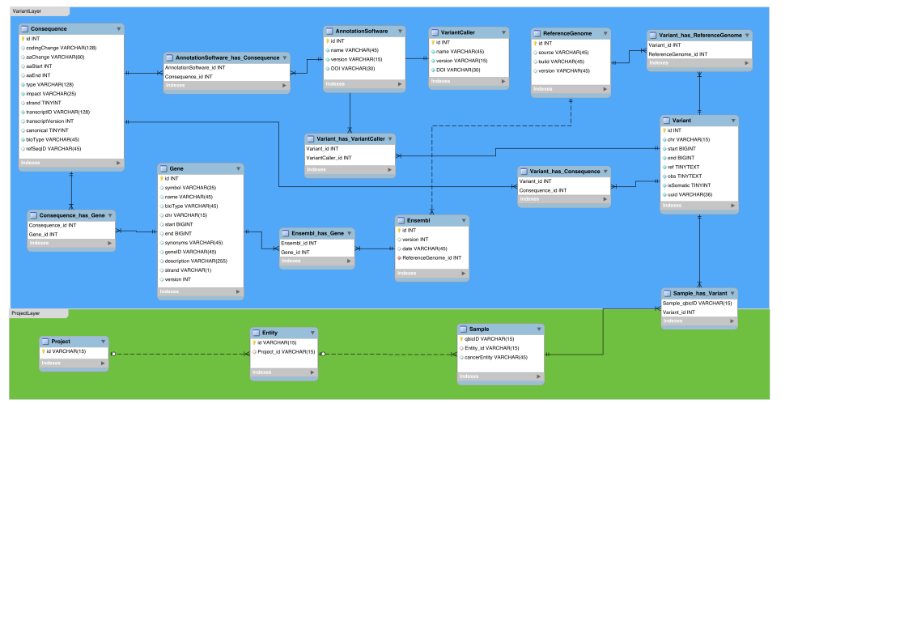

THIS SERVICE IS WORK IN PROGRESS.

# OncoStore Service
Service that implements a sample tracking interface.

## Micronaut app
This service is build with [micronaut](https://micronaut.io):

```
mn create-app life.qbic.oncostore --features=groovy --build maven
```

### Run locally

```
./mvnw compile
./mvnw exec:exec
```

### Execute tests

```
./mvnw test 
```

## Data model
The data model that holds sample tracking information is denfined by attributes and relations shown in the following ER diagram.



## API design
The remote RESTful API documentation will be provided on [SwaggerHub](https://swagger.io/tools/swaggerhub/).