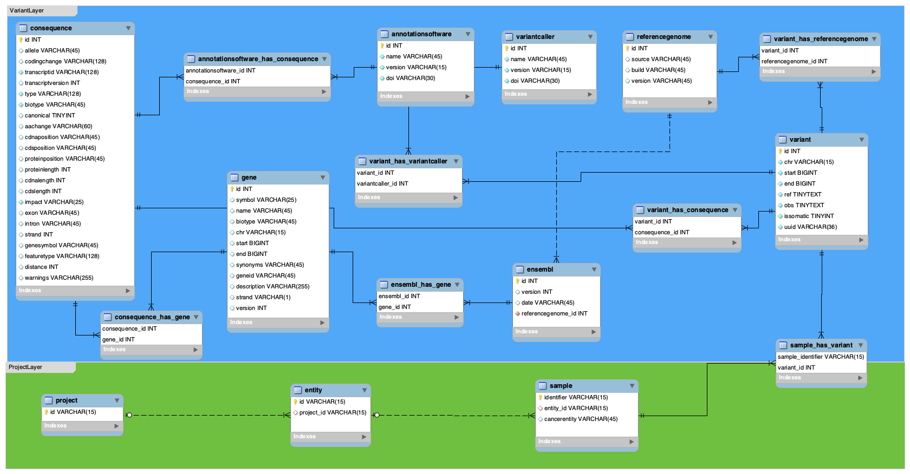

**THIS SERVICE IS WORK IN PROGRESS.**

# Variantstore
The Variantstore is a Java/Groovy-based service application implemented using the [Micronaut framework](https://micronaut.io) and enables storage and access to information on genomic variants and metadata from a connected database via an RESTful API. 

## Quick Start

Stable releases of the Variantstore are bundled as an executable `jar` and can be downloaded from the [releases](https://github.com/qbicsoftware/oncostore-proto-project/releases) page. You can start the service by using the following command:

`java -jar variantstore-<version>.jar`

Please make sure that the required environment variables are set accordingly as described [here](#Configuration).
## Documentation

Please refer to the following sections if you would like to run the **Variantstore** service on your system. Currently, the **Variantstore**
provides the following main features: 
* Import metadata (JSON files using [this](https://github.com/qbicsoftware/mtb-metadata-specs/blob/master/schemes/mtb/variants.metadata.schema.json) scheme) 
* Import variants (VCF files, annotated using [SnpEff](http://snpeff.sourceforge.net) or [VEP](https://www.ensembl.org/info/docs/tools/vep/index.html)) 
* Import gene information (Ensembl, GFF3 files)  
* Query variant information via REST endpoints

### Configuration
The configuration of the **Variantstore** instance is done by setting the environment variables which are used in the [`application.yml`](https://github.com/qbicsoftware/oncostore-proto-project/blob/development/src/main/resources/application.yml).

```
server:
    port: ${variantstore-port:8080}

 ...

 datasources:
   default:
     url: jdbc:mariadb://${db-host}/${db-name}?maxPoolSize=150&pool&log=true&rewriteBatchedStatements=true
     username: ${db-user}
     password: ${db-pwd}
     driverClassName: org.mariadb.jdbc.Driver
```

If you want to use a port other than 8080, set the optional environment variable `VARIANTSTORE_PORT`. The default data source can be configured by the following environment variables: `DB_HOST` (database host address), `DB_NAME` (database name), `DB_USER`(database user) and `DB_PWD`(database password).

### Logging
All requests to the **Variantstore** are logged. The default location is `tmp` but you can specify a different location by 
setting the environment variable `SERVICES_LOG_PATH`. The current log file is called `variantstore.log` whereas older 
log files follow the following naming scheme `variantstore.%d{dd-MMM}.log.gz".`

### Run Variantstore
Use the following commands to compile and run the service if you do not want to use the executable `jar`
(prerequisite: [Maven](https://maven.apache.org)).
#### Compile
```bash
mvn clean compile
```

#### Run service
```bash
mvn exec:exec
```

#### Create executable jar
```bash
mvn clean package
```

This command will create an executable `jar` in your current working directory under `/target`. Execute it as described 
[above](#quick-start).

### Database
In the current version, the **Variantstore** service can be used with a MariaDB database. If you want to use a different DBMS,  
make sure to specify the database model, set up the datasource in the [`application.yml`](https://github.com/qbicsoftware/oncostore-proto-project/blob/development/src/main/resources/application.yml), 
and provide an implementation for the `VariantstoreStorage` interface. 

The database model expected by the **Variantstore** is the following:
 We are currently working on the support of [PostgreSQL](https://www.postgresql.org).
``
### REST API
The detailed documentation of the REST endpoints provided by the **Variantstore** can be found on [SwaggerHub](https://app.swaggerhub.com/apis/christopher-mohr/variantstore/0.2).
Additionally, views for the generated OpenAPI specification are generated as swagger-ui and rapidoc views. After startup, these views are accessible via /swagger-ui` and `.../rapidoc`.
                                                                                                                                                          


**GET /genes/{id}**  
Request a gene

**GET /genes**  
Request a set of genes

**POST /genes/upload**  
Upload gene information

**GET /variants/{id}**  
Request a variant

**GET /variants**  
Request a set of variants

**POST /variants/upload**  
Upload variant information 

**GET /cases/{id}**  
Request a case

**GET /cases**  
Request a set of cases

**GET /samples/{id}**  
Request a sample

**GET /samples/**  
Request a set of samples

**GET /beacon/query**  
Query the beacon for a variant

#### Built-in Endpoints

**GET /health**  
Status of the Variantstore service

**GET /swagger-ui**  
OpenAPI documentation in swagger-ui format

**GET /rapidoc**  
OpenAPI documentation in rapidoc format


## Contribute
If you found a bug or have a feature request, feel free to open an [issue](https://github.com/qbicsoftware/oncostore-proto-project/issues/new).

## Credits
This software was written by Christopher Mohr ([christopher-mohr](https://github.com/christopher-mohr)).