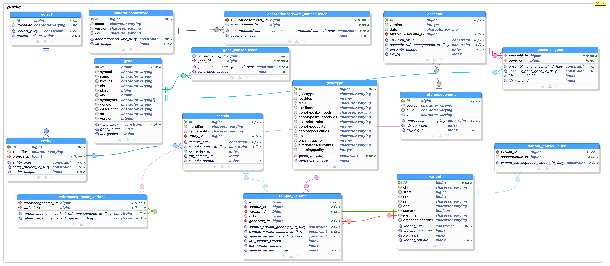
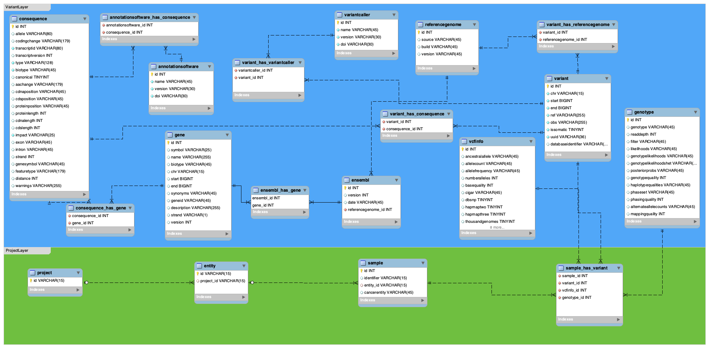
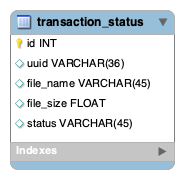

# Configuration

The configuration of the Variantstore instance is essentially done by setting the environment variables which are used in the [application.yml](../src/main/resources/application.yml). If you want/need to set other properties, please refer to the [Micronaut Documentation](https://docs.micronaut.io/latest/guide/#introduction).

## Server

You can set the port on which the Variantstore instance is supposed to run by setting the optional environment variable `VARIANTSTORE_PORT`(default: `8080`).

```yml
server:
    port: ${variantstore-port:8080}
```

## Security (Authentication and Authorization)

-----------

Security (authentication and authorization) is enabled by default but you can deactivate it by setting the environment variable `VARIANTSTORE_SECURITY_ENABLED` to `false`. If security is enabled all protected endpoints (i.e. all endpoints except the `/beacon` endpoint) can only be accessed by authenticated users.

In addition to that, the Variantstore supports authentication with OAuth 2.0 servers. This includes support for the OpenID standard. At the moment we only tested/support the option to use Keycloak as provider.

In order to enable authentication with OAuth 2.0 servers, set `VARIANTSTORE_OAUTH2_ENABLED` to `true` and provide all necessary details using the following environment variables:

* `VARIANTSTORE_OAUTH2_CLIENT_ID`
* `VARIANTSTORE_OAUTH2_CLIENT_SECRET`
* `VARIANTSTORE_OAUTH2_ISSUER`
* `VARIANTSTORE_OAUTH2_AUTH_URL`
* `VARIANTSTORE_OAUTH2_TOKEN_URL`

> You can check out the official Micronaut security [docs](https://micronaut-projects.github.io/micronaut-security/latest/guide/#oauth) for an configuration examples.

## Database

-----------

In the current version, the **Variantstore** service can be used with a PostgreSQL or MariaDB database instance. If you would like to use a different DBMS, you have to provide an implementation for the `VariantstoreStorage` interface, make sure to use the same database model as provided and set up the data source accordingly in the `application.yml`.

The main database [model](https://github.com/qbicsoftware/variantstore-service/blob/development/models/) expected by the **Variantstore** looks like the following for the currently supported two database systems:

<details>
  <summary>PostgreSQL schema</summary>

  
</details>

<details>
  <summary>MariaDB schema</summary>

  
</details>

\
Additionally, a database with the following [table](https://github.com/qbicsoftware/variantstore-service/blob/development/models/transaction-db.sql) is needed to track the import transactions in the Variantstore:



 The `Variantstore` data source can be configured by setting the following environment variables: `DB_HOST` (database host address), `DB_NAME` (database name), `DB_USER` (database user) and `DB_PWD` (database password). In addition, `DB_TRANSACTION_HOST`, `DB_TRANSACTION_NAME`, `DB_TRANSACTION_USER`, and `DB_TRANSACTION_PW` have to be specified for the transaction database.

If you need to change or add additional properties to the JDBC database connection URL, please do so in the `application.yml`.

```yml
datasources:
    variantstore_postgres:
        url: jdbc:postgresql://${db-host}/${db-name}
        username: ${db-user}
        password: ${db-pwd}
        driverClassName: org.postgresql.Driver
    transactions:
        url: jdbc:postgresql://${db-transaction-host}/${db-transaction-name}?...
        username: ${db-transaction-user}
        password: ${db-transaction-pwd}
        driverClassName: org.postgresql.jdbc.Driver
    #variantstore_mariadb:
    #  url: jdbc:mariadb://${db-host}/${db-name}?...
    #  username: ${db-user}
    #  password: ${db-pwd}
    #  driverClassName: org.mariadb.jdbc.Driver
    #transactions_mariadb:
    #  url: jdbc:mariadb://${db-transaction-host}/${db-transaction-name}?...
    #  username: ${db-transaction-user}
    #  password: ${db-transaction-pwd}
    #  driverClassName: org.mariadb.jdbc.Driver
```

The data source configuration is set to PostgreSQL by default. If you want to use a MariaDB database comment out `variantstore_postgres` and `transactions` and uncomment `variantstore_mariadb` and `transactions_mariadb`.

Additionally, you have to enable (`enabled: true`) Flyway migration for the MariaDB data sources and disable it for the PostgreSQL data sources (`enabled: false`) below in the Flyway block:

```yml
flyway:
  datasources:
  ...
```

## Logging

-----------
All requests to the Variantstore are logged. The default location is ``/tmp`` but you can specify a different location by setting the environment variable ``SERVICES_LOG_PATH``. The generated log file is called ``variantstore.log`` whereas older log files follow the following naming scheme: ``variantstore.%d{dd-MMM}.log.gz"``
